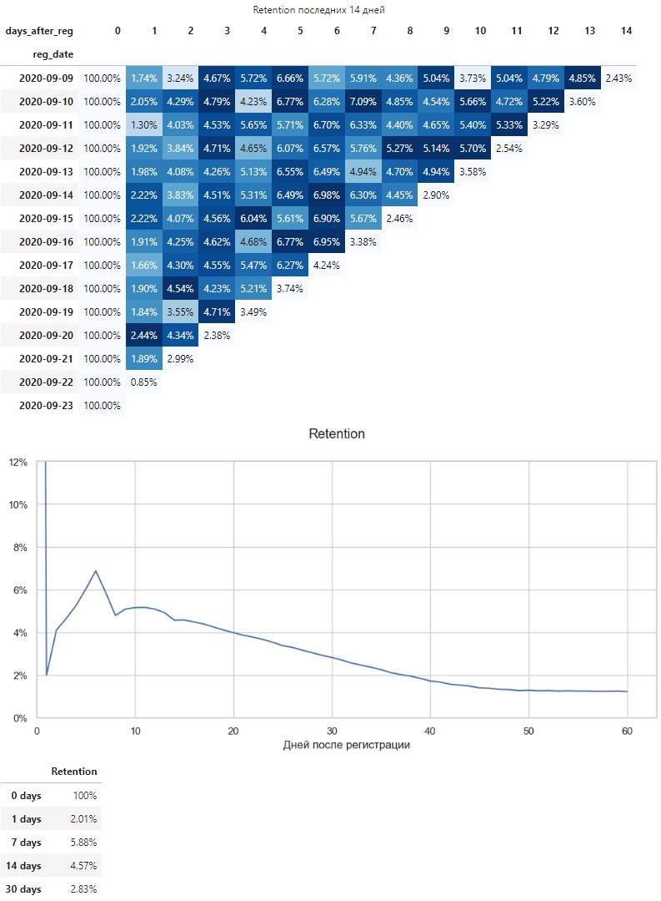

<h1>Retention игроков мобильной игры</h1>

<p>Задача – написать функцию, которая будет считать retention игроков (по дням от даты регистрации игрока).</p>

<h2>Данные</h2>

<p>Данные с 18-11-1998 по 23-09-2020.</p>

<h3>reg_data</h3>
<table>
  <thead>
    <tr>
      <th>reg_ts</th>
      <th>uid</th>
    </tr>
  </thead>
  <tbody>
    <tr>
      <td>911382223</td>
      <td>1</td>
    </tr>
    <tr>
      <td>932683089</td>
      <td>2</td>
    </tr>
    <tr>
      <td>947802447</td>
      <td>3</td>
    </tr>
  </tbody>
</table>

<h3>auth_data</h3>
<table>
  <thead>
    <tr>
      <th>auth_ts</th>
      <th>uid</th>
    </tr>
  </thead>
  <tbody>
    <tr>
      <td>911382223</td>
      <td>1</td>
    </tr>
    <tr>
      <td>932683089</td>
      <td>2</td>
    </tr>
    <tr>
      <td>932921206</td>
      <td>2</td>
    </tr>
  </tbody>
</table>

<h2>Аргументы Retention()</h2>
<ul>
  <li>path_to_reg: df с временем регистраций;</li>
  <li>path_to_auth: df с временем захода пользователей в игру;</li>
  <li>start_date: первая дата для расчета ретеншен в формате "YYYY-MM-DD", по умолчанию минимальная дата;</li>
  <li>weight_avg: расчет взвешенного среднего арифметического Retention по дням, если True. 
    По умолчанию False - расчет среднего арифметического.</li>
  <li>y_limit (True/False): устанавливает ограничение максимального значения оси Y для удобства при низком retention,
    по умолчанию True;</li>
  <li>max_days: количество дней для построения графика retention, по умолчанию max_days = 60;</li>
  <li>check_days: указываются дни в формате списка для вывода информации по доле вернувшихся пользователей,
    по умолчанию check_days = [] и информация не выводится.</li>
</ul>

<h2>Пример вызова функции</h2>

```python
retention(reg_data,
          auth_data,
          check_days=[0, 1, 7, 14, 30],
          weight_avg=True)
```


